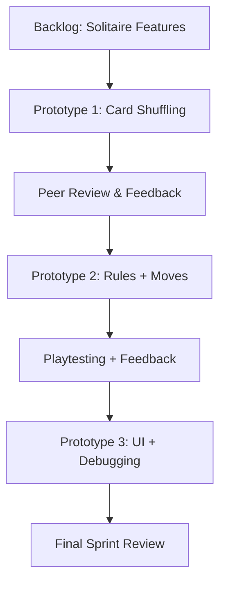

## Agile Setup

This sprint, our team applied **Agile methodology** to collaboratively build our Solitaire game.  
Instead of trying to finish everything in one go, we worked in **short iterations**—building a feature, testing it, and refining it based on feedback.  

The Agile Manifesto emphasizes **collaboration, responding to change, and working software over documentation**. Our process reflected that: each member took on a role and contributed through frequent commits, peer reviews, and shared debugging sessions.

## Team Structure

| Role                   | Name     | Repo Location                                     | Stream                | Repo Name |
|------------------------|----------|---------------------------------------------------|-----------------------|-----------|
| Scrum Master           | Risha G  | github.com/blackstar3092/student                  | upstream (OCS fork)   | student   |
| Assistant Scrum Master | Anvay V  | github.com/CyberLord09/student                    | downstream (fork)     | student   |
| Scrummer               | Ruta S   | github.com/ruta-sir/student                       | downstream (fork)     | student   |
| Scrummer               | Vibha M  | github.com/vibha1019/student                      |                       |           |
| Scrummer               | Aadi B   | github.com/aadibhat09/student                     | downstream (fork)     | student   |
| Scrummer               | Neil C   | github.com/neil9674/student                       | downstream (fork)     | student   |

---

## Iterative Prototyping Workflow

We didn’t try to make a perfect Solitaire game on the first try. Instead, we used **iterative prototyping**:  

1. **Prototype 1:** Basic card shuffling and rendering.  
2. **Prototype 2:** Added rules for moves and a win condition.  
3. **Prototype 3:** Integrated feedback, UI polish, and debugging.  

At each stage, we tested in pairs, logged peer review notes, and made joint commits to keep everyone in sync.  

## Visual: Agile Sprint Flow

## Manifesto Evidence

**Peer Review Logs:** We reviewed each other's rubrics and ideas. This prevented bugs and ensured consistent coding style.

**Joint Commits:** Features like the shuffle function and rule-checking were developed collaboratively, with commits authored by multiple teammates. Screenshots of GitHub commits, pull requests, and collaborative coding sessions (Live Share) serve as evidence of our teamwork.

## Reflection

Working with others through Agile gave me new insights into Learning Experience Design (LxD):

**Frequent Feedback Loops:** Instead of waiting until the end, feedback came early. This helped us spot design flaws quickly and adapt our plan.

**Shared Ownership:** By doing pair reviews and joint commits, I learned how different coding styles can be merged into one consistent project.

**Iterative Mindset:** I realized that Agile is about building usable versions often, then refining them through collaboration.

Overall, collaboration shifted my approach from “working alone on a perfect product” to “building together, learning from mistakes, and improving step by step.” This mindset will help me in future LxD projects because feedback and iteration are at the core of designing meaningful learning experiences.
